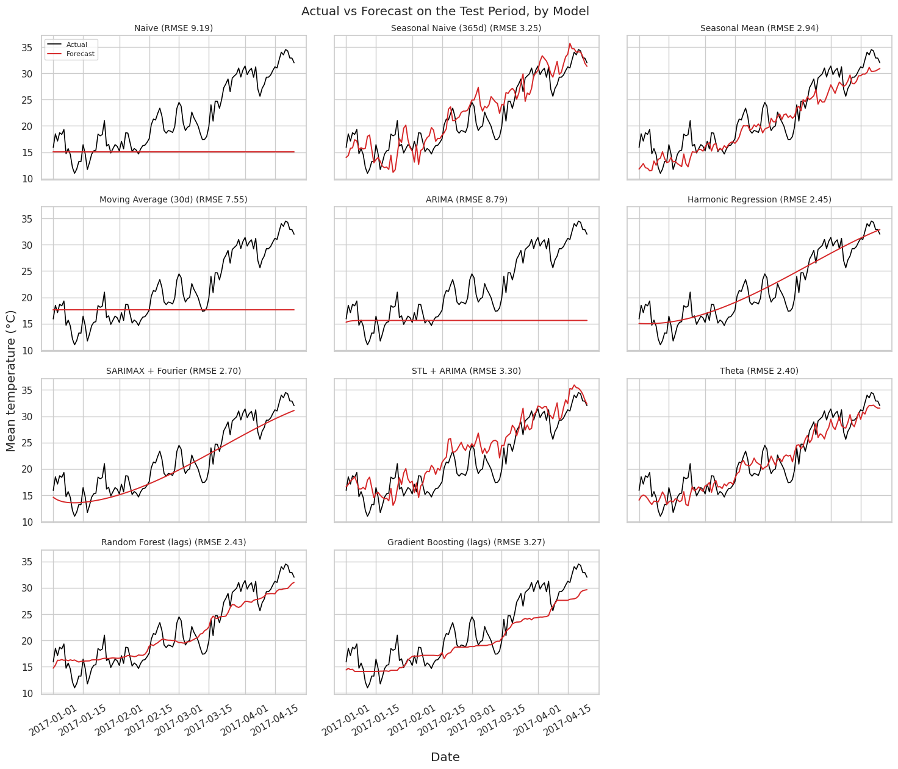

# Time Series Analysis and Forecasting of Daily Temperature in Delhi

A beginner-to-intermediate time-series project that takes Delhi's daily climate data from two raw CSV files to an 11-model forecasting comparison and a 90-day forecast. Every step is explained in a *Concept → Why → Code → Interpretation* format.

## Project Overview

The notebook analyses daily observations for Delhi, India (2013 – April 2017) and forecasts the **daily mean temperature (°C)**. The training file is used for exploration and model fitting. The provided test file is used as a chronological hold-out set. The workflow covers data preparation, exploratory analysis, decomposition, stationarity testing, ACF/PACF, baseline, classical and machine-learning models, residual diagnostics and a documented model-selection rule.

## Dataset

- **Name:** Daily Climate Time Series Data
- **Source:** https://www.kaggle.com/datasets/sumanthvrao/daily-climate-time-series-data
- **Training file:** `DailyDelhiClimateTrain.csv`, 1,462 rows × 5 columns (`date`, `meantemp`, `humidity`, `wind_speed`, `meanpressure`), daily from 2013-01-01 to 2017-01-01
- **Test file:** `DailyDelhiClimateTest.csv`, 114 rows, daily, early 2017
- **Target:** `meantemp` (daily mean temperature, °C)
- According to the dataset page, the data was collected from the Weather Underground API.

### Data quality finding: the shared date 2017-01-01

Both files contain the date 2017-01-01, with very different values:

| File | mean_temp | humidity | wind_speed | mean_pressure |
|---|---:|---:|---:|---:|
| Train | 10.0 | 100.0 | 0.0 | 1016.0 |
| Test | 15.91 | 85.87 | 2.74 | missing |

The training version has round, placeholder-like values in every column, while the test version looks like a normal measurement. The notebook therefore **drops the row from the training set** and keeps the test file exactly as provided. Training ends on **2016-12-31** and the test period is **2017-01-01 to 2017-04-24 (114 days)**. This is a judgement call, and it matters: in a first run that kept the suspicious row as the last training value, the Naive forecast had an RMSE of about 13.4 °C, because it was anchored at 10 °C. After the fix, the Naive RMSE fell to about 9.2 °C. It is still high because the temperature climbs from winter to spring during the test window, and a flat forecast cannot follow it.

## Objectives

- Prepare and index time-series data correctly (datetime handling, gap and duplicate checks, abnormal-value flagging)
- Identify trend and seasonality with rolling statistics, resampling and decomposition
- Test stationarity (ADF) and apply differencing only when justified
- Read ACF and PACF plots
- Validate forecasts chronologically with no data leakage
- Compare baseline, classical and machine-learning models
- Diagnose residuals and forecast with uncertainty

## Technologies Used

Python, pandas, NumPy, Matplotlib, Seaborn, statsmodels, scikit-learn, Jupyter

## Methodology

1. Load and inspect both files
2. Clean: datetime conversion, sorting, duplicate and gap checks, plausibility checks (abnormal values are flagged, not invented), and resolution of the date shared by both files
3. Explore the **training data only**: rolling mean and standard deviation, distribution, calendar patterns
4. Resample to weekly and monthly means
5. Additive decomposition (period = 365)
6. Stationarity: ADF test and first-order differencing
7. ACF and PACF
8. Fit 11 models on the training file; score them on the test file with a multi-step forecast of the whole test period
9. Residual analysis of the lowest-RMSE model
10. Refit on train + test and forecast the next 90 days

## Models Used (11)

| Model | Family |
|---|---|
| Naive | baseline |
| Seasonal Naive (365 days) | baseline |
| Seasonal Mean (same date, all earlier years) | baseline |
| Moving Average (30 days) | smoothing |
| ARIMA | classical, non-seasonal |
| Harmonic Regression (linear trend + Fourier terms) | regression |
| SARIMAX + Fourier terms | classical, seasonal regressors with ARIMA errors |
| STL + ARIMA | decomposition |
| Theta (additive seasonal adjustment) | classical |
| Random Forest (lags + seasonal terms, recursive) | machine learning |
| Gradient Boosting (lags + seasonal terms, recursive) | machine learning |

A classic `SARIMA(...)[365]` is avoided on purpose: it is impractical for daily data with a yearly season. ARIMA orders were chosen by a small AIC search (orders 0–2) on training data only. The machine-learning models use fixed, untuned hyperparameters.

## Evaluation Metrics

MAE, RMSE and MAPE on the same test period. MAPE is reported with a caveat: the Celsius scale has an arbitrary zero, so percentage errors are not fully meaningful.

## Key Findings

**Data and seasonality**

- Temperature follows a strong yearly cycle: seasonal strength from the decomposition is **0.94**.
- On average **June is the warmest month (33.7 °C)** and **January the coldest (13.3 °C)**.
- There is no meaningful weekly pattern, as expected for weather data.

**Trend**

- Yearly means of the complete training years: 2013: 24.8 °C, 2014: 25.0 °C, 2015: 25.1 °C, 2016: 27.1 °C.
- Trend strength is only **0.17**. 2016 was warmer, but one warm year in a four-year sample is not enough to claim a long-term trend.

**Stationarity**

- ADF p-value on the original series: **0.2228**, so the unit-root hypothesis is not rejected.
- ADF p-value after first-order differencing: **≈ 0.0000**.
- Differencing order used for ARIMA: **d = 1**.

**Model performance on the test file (114 days), sorted by RMSE**

| Model | MAE | RMSE | MAPE (%) |
|---|---:|---:|---:|
| Theta | 1.977 | 2.396 | 9.812 |
| Random Forest (lags) | 2.017 | 2.434 | 9.914 |
| Harmonic Regression | 2.021 | 2.448 | 10.426 |
| SARIMAX + Fourier | 2.187 | 2.703 | 10.229 |
| Seasonal Mean | 2.319 | 2.942 | 11.030 |
| Seasonal Naive (365d) | 2.615 | 3.249 | 13.628 |
| Gradient Boosting (lags) | 2.601 | 3.268 | 11.448 |
| STL + ARIMA | 2.654 | 3.298 | 14.160 |
| Moving Average (30d) | 5.680 | 7.549 | 23.167 |
| ARIMA | 6.635 | 8.788 | 26.051 |
| Naive | 7.038 | 9.190 | 27.689 |

- **Selected model (lowest RMSE): Theta** (RMSE 2.396 °C, MAE 1.977 °C).
- **The top three models are practically tied.** Theta, Random Forest and Harmonic Regression differ by only about 0.05 °C RMSE. With 114 test days from one part of the year, this is not a meaningful difference, so the choice of Theta is a documented rule, not evidence that it is clearly the best.
- **Seasonal models clearly beat non-seasonal ones.** Models that represent the yearly cycle have RMSE of about 2.4-3.3 °C, while Moving Average, non-seasonal ARIMA and Naive are at 7.5-9.2 °C. Without a seasonal component, a model cannot follow the seasonal rise from winter to spring.
- **The ranking is not stable.** In the first run (before the data fix below), Harmonic Regression was first and Theta was fifth. Changing a single training row reordered the top of the table, which is another reason not to over-interpret small gaps.

**Forecast**

- The selected model is refitted on train + test and forecasts the 90 days after the test period (from 2017-04-25), which reaches into the pre-monsoon and monsoon months. These months were **not** in the test window, so the forecast deserves extra caution. See the forecast figure above.
- The notebook's Theta forecast is a point forecast without a prediction interval. Intervals are available for ARIMA and SARIMAX + Fourier.

## Figures

All plots are produced by the notebook and saved in the `figures/` folder.

### All 11 models vs the actual test values


### The three lowest-RMSE models


### 90-day forecast


## Limitations

- **Short test window:** about 114 days (winter to early summer), so the ranking does not cover the monsoon or the hottest months.
- **Test set used twice:** it is used both to compare models and to choose one. A separate validation period or rolling-origin cross-validation would be more rigorous.
- **Short history:** only about four years of training data.
- **Univariate models:** humidity, wind and pressure are not used.
- **Theta provides no prediction interval** in this notebook, so the final forecast has no uncertainty band if it is selected.
- **Untuned machine-learning models**, and recursive forecasting accumulates errors over long horizons.
- **Constant variance assumed** in prediction intervals.
- **Data quality:** abnormal values exist in other columns (for example pressure) and the data comes from a third-party API.

## Repository Structure

```text
time-series-analysis-project/
├── README.md
├── requirements.txt
├── .gitignore
├── notebooks/
│   └── time_series_analysis.ipynb
├── data/
│   └── README.md
├── src/
│   └── README.md
└── figures/
    └── README.md
```

## How to Run

```bash
git clone https://github.com/<your-username>/time-series-analysis-project.git
cd time-series-analysis-project
python -m venv .venv
source .venv/bin/activate        # Windows: .venv\Scripts\activate
pip install -r requirements.txt
# download both CSV files into data/ (see data/README.md)
jupyter notebook notebooks/time_series_analysis.ipynb
```

**Google Colab:** upload both CSV files to `/content/` and run the notebook. It looks there first.

## Dataset / License Note

The dataset belongs to its original provider and is not redistributed here. Check the licence and terms on the Kaggle page and the original source before any reuse.

## Future Improvements

- Rolling-origin (walk-forward) cross-validation
- A separate validation period, so the test file is used only once
- Tune the machine-learning models
- Add humidity, pressure and wind as exogenous regressors (their future values would need forecasting)
- Add prediction intervals for the selected model (for example by bootstrapping residuals)
- Compare with ETS and Prophet
- Move helper functions into `src/` and add tests
